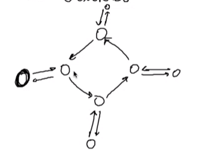

# Grafi

Componenti: Vertici e Archi
$$
G = \braket{V, A}\\
V = \{ Vertici \}\\
A \subseteq V \times V\\
$$

Esempio Grafo Diretto:
$$
G = \{ 1, 2, 3 \}\\
A = \{ (1,2), (2,3)  \}\\					% Single-linked
A = \{ (1,2), (2,1), (2,3), (3,2) \}\\		% Double-linked
$$

Esempio Grafo indiretto:
$$
V = \{Vertici\}\\
A = \{\{a,b\} : a,b \in V\}\\
A = \{\{1,2\}, \{2,3\}\}
$$

Numero di Nodi e Archi:
- Grafo Diretto:
  - Nodi: 4 : n
  - Archi: 16 : $n^2$
    - Perché $\sum(x,y)$
- Grafo Indiretto:
  - Nodi: 4 : n
  - Archi: 10 : $\frac{n^2 + n}{2} = \frac{n (n+1)}{2}$

#### DAG (Direct Acyclic Graph)

#### Caso generale

## Implementazione
- Nodi = array di chiavi
- Archi 
  - array di archi uscenti | (lista di adiacenza)
  
  - Altrimenti: Matrice esplicita di valori logici per ogni 2 nodi: 0/1 arco no/si

**Percorso** all'interno di un grafo: Una sequenza di archi che permettono di raggiungere un nodo a partire da un altro

**Raggiungibilità**: Un nodo è raggiungibile da un altro se c'è almeno un percorso che permette di raggiungerlo

Spazio Occupato:
$$
G(V, E)\\
|E| = \mathcal O(|V|^2)\\
|E| \leq |V|^2
$$
Lista di adiacenza non arriva sempre al caso peggiore nello spazio mentre la matrice si, però dal punto di vista della ricerca di archi di connessione la matrice da il risultato in tempo costante mentre la lista in caso peggiore tempo lineare.

 

Modello Stradale: `Strade -> Grafo`

## Visita
- Chiamate ricorsive, ma non so il numero massimo di nodi adiacenti, quindi ho bisogno di un ciclo per scorrerli tutti
  - Ma in un DAG Potrebbe succedere di moltiplicare i flussi di visita, che quindi causa la visita di un nodo un numero esponenziale di volte, perché 
  - Perché nel caso dei grafi la semantica di controllare tutti i cammini che permettono di raggiungere un certo nodo è diversa dal visitare tutti i nodi
  - Nel caso di un grafo generico in cui potrebbero esserci cicli è ancora più problematico perché la visita ricorsiva non termina mai
- La soluzione è mantenere l'informazione sui nodi che sono già stati visitati (una flag), e nel caso che questa sia vera la visita ritorna subito, questo accorgimento permette alla visita di ritornare in O(n)
- I nodi esplorati in cui scendo identificano un albero di visita, un albero che copre tutti i nodi del grafo escludendo quelli già visitati
- DFS (Depth First Search) [Ricorsiva + Callstack] Tecnica di visita che espande le chiamate ricorsive come prima cosa e poi torna indietro quando: ci sono vicoli ciechi nel grafo oppure si visitano solo nodi già visti (usata anche per trovare soluzioni di labirinti)
- BFS (Breadth First Search) [Iterativa + Coda] Prima visito tutti i nodi a distanza 1, poi  quelli a distanza 2 e così via, per fare questo tipo di visita invece che lo stack di chiamate della ricorsione si usa la struttura simmetrica: coda; e ci aggiungo tutti i nodi successori del prossimo livello che dovrò esplorare, e quindi si procede per strati