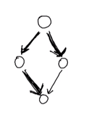

# Grafi

Componenti: Vertici e Archi
$$
G = \braket{V, A}\\
V = \{ Vertici \}\\
A \subseteq V \times V\\
$$

Esempio Grafo Diretto:
$$
G = \{ 1, 2, 3 \}\\
A = \{ (1,2), (2,3)  \}\\					% Single-linked
A = \{ (1,2), (2,1), (2,3), (3,2) \}\\		% Double-linked
$$

Esempio Grafo indiretto:
$$
V = \{Vertici\}\\
A = \{\{a,b\} : a,b \in V\}\\
A = \{\{1,2\}, \{2,3\}\}
$$

Numero di Nodi e Archi:
- Grafo Diretto:
  - Nodi: 4 : n
  - Archi: 16 : $n^2$
    - Perché $\sum(x,y)$
- Grafo Indiretto:
  - Nodi: 4 : n
  - Archi: 10 : $\frac{n^2 + n}{2} = \frac{n (n+1)}{2}$

#### DAG (Direct Acyclic Graph)


#### Caso generale


## Implementazione
- Nodi = array di chiavi
- Archi 
  - array di archi uscenti | (lista di adiacenza)
  
  - Altrimenti: Matrice esplicita di valori logici per ogni 2 nodi: 0/1 arco no/si


**Percorso** all'interno di un grafo: Una sequenza di archi che permettono di raggiungere un nodo a partire da un altro

**Raggiungibilità**: Un nodo è raggiungibile da un altro se c'è almeno un percorso che permette di raggiungerlo

Spazio Occupato:
$$
G(V, E)\\
|E| = \mathcal O(|V|^2)\\
|E| \leq |V|^2
$$
Lista di adiacenza non arriva sempre al caso peggiore nello spazio mentre la matrice si, però dal punto di vista della ricerca di archi di connessione la matrice da il risultato in tempo costante mentre la lista in caso peggiore tempo lineare.

<br>


Modello Stradale: `Strade -> Grafo`


## Visita
- Chiamate ricorsive, ma non so il numero massimo di nodi adiacenti, quindi ho bisogno di un ciclo per scorrerli tutti
  - Ma in un DAG Potrebbe succedere di moltiplicare i flussi di visita, che quindi causa la visita di un nodo un numero esponenziale di volte, perché 
  - Perché nel caso dei grafi la semantica di controllare tutti i cammini che permettono di raggiungere un certo nodo è diversa dal visitare tutti i nodi
  - Nel caso di un grafo generico in cui potrebbero esserci cicli è ancora più problematico perché la visita ricorsiva non termina mai
- La soluzione è mantenere l'informazione sui nodi che sono già stati visitati (una flag), e nel caso che questa sia vera la visita ritorna subito, questo accorgimento permette alla visita di ritornare in O(n)
- I nodi esplorati in cui scendo identificano un albero di visita, un albero che copre tutti i nodi del grafo escludendo quelli già visitati
- **DFS** (Depth First Search) [Ricorsiva + Callstack] Tecnica di visita che espande le chiamate ricorsive come prima cosa e poi torna indietro quando: ci sono vicoli ciechi nel grafo oppure si visitano solo nodi già visti (usata anche per trovare soluzioni di labirinti)
- **BFS** (Breadth First Search) [Iterativa + Coda] Prima visito tutti i nodi a distanza 1, poi  quelli a distanza 2 e così via, per fare questo tipo di visita invece che lo stack di chiamate della ricorsione si usa la struttura simmetrica: coda; e ci aggiungo tutti i nodi successori del prossimo livello che dovrò esplorare, e quindi si procede per strati
  - Nel caso di DAG si può prendere il percorso minimo che raggiunge quel nodo come distanza

_Proprietà dei grafi ciclici e aciclici e identificazione:_
- Sequenza di nodi in cui ad un certo punto un nodo succcessore diventa anche antenato del primo nodo della sequenza considerata
- Se nella visita DFS:
  - Gli archi finiscono sempre su nodi con stato grigio (non ancora visitati), si tratta di un albero/lista
  - Gli archi finiscono almeno 1 volta su un nodo con stato nero (già visitato e abbandonato per sempre), si tratta almeno di un DAG
  - Gli archi finiscono almeno 1 volta su un nodo con stato rosso (già visitato ma non ancora abbandonato per sempre) -> c'è almeno un ciclo nel grafo

## Archi Pesati
- Informazione per ogni arco (e.g. Proprietà della strada, tempo di percorrenza medio, velocità massima consentita)
- BFS (visita in ampiezza): trova il percorso più corto in base al numero di nodi attraversati, ma se gli archi hanno un peso non permette di trovare il percorso migliore
- Potrebbero anche esserci più informazioni diverse contemporaneamente sugli archi, che devono quindi essere mediate o scelte per decidere il percorso

### Algoritmo di Dijkstra
- Provare i vari percorsi (in stile BFS) per raggiungere un nodo intermedio e marcare questo nodo con la sommatoria dei segmenti con il numero minimo rispetto agli altri (ogni volta che trovo un percorso parziale più conveniente aggiorno l'informazione sul nodo)
- Grafo e nodo di incresso
- Informazione sulla distanza del nodo (inizializzata a infinito)
- Informazione sul nodo precedente (inizializzata a indefinito)
- Coda di vertici del grafo
- Per ogni nodo estratto si vedono i suoi adiacenti
- L'identificazione del nodo che ha distanza minima ha come caso peggiore O(n) 
- Pseudocodice:
```
 1  function Dijkstra(Graph, source):
 2
 3      for each vertex v in Graph.Vertices:            
 4          dist[v] ← INFINITY                 
 5          prev[v] ← UNDEFINED                
 6          add v to Q                     
 7      dist[source] ← 0                       
 8     
 9      while Q is not empty:
10          u ← vertex in Q with min dist[u]   
11          remove u from Q
12                                        
13          for each neighbor v of u still in Q:
14              alt ← dist[u] + Graph.Edges(u, v)
15              if alt < dist[v]:              
16                  dist[v] ← alt
17                  prev[v] ← u
18
19      return dist[], prev[]
```
- L'utilizzo di una coda di priorità (implementabile come heap), ottimizza l'algoritmo O(v^2) -> O(edge+v*logn)


## Precedenze su grafo
- `A -> B => A <= B`
- `A -> B & B -> A => A == B` (A e B appartenenti nella stessa classe di equivalenza) (per i cicli)
- Esempio DAG `A -> B & A -> C & C -> D & B -> D`: Possibili ordinamenti totali `A -> B -> C -> D | A -> C -> B -> D`
- Nel caso di una lista ho un ordinamento totale forzato e unico
- Grafo in cui qualsiasi ordinamento è lecito: Grafo senza archi, qualsiasi nodo può avere precedenza su altri (ordinamenti: `#nodi!`)
- Nel caso di un Grafo Completo: Si impone che tutti i nodi siano uguali (quindi con la stessa precedenza)

### Ordinamento Topologico
- Funziona solo sui DAG (si possono sostituire nodi con la stessa precedenza [cicli] con un solo nodo)
- 
- Esempio di Algoritmo basato su DFS
  - Si Parte da nodi senza archi entranti
**Pseudocodice:**
```
L ← Lista vuota (conterrà i nodi ordinati)
S ← Insieme di tutti i nodi senza archi entranti
for each nodo n in S do
    visit(n) 
return L

function visit(nodo n)
    if n non è ancora stato visitato then
        marca n come visitato
        for each nodo m con un arco da n a m do
            visit(m)
        aggiungi n a L
```

### Componenti Fortemente Connesse
- Cicli che permettono in qualunque caso di raggiungere ogni punto della sezione del grafo
- Chiamate componenti fortemente connesse
- Esse possono essere identificate come dei gruppi di nodi che a loro volta possono essere utilizzati per creare un percorso aciclico attraverso questi gruppi (DAG)
- Diventa quindi possibili usare l'ordinamento topologico su questo nuovo grafo con le strongly connected components collassate in un unico modo
- Una componente aciclica può sapere dell'altra ma non viceversa, altrimenti le 2 componenti sarebbero fuse
- Es:
  -  Flusso delle informazioni che migrano sulle varie comunità
  -  Componenti fortemente connesse di una rete stradale
- Se un nodo non appartiene ad un ciclo l'unica componente connessa a cui appartiene è quella dove c'è solo lui stesso
- Le componenti fortemente connesse vengono prese come sottoalberi  dell'albero di visita di DFS
- qualsiasi nodo di una componente può essere la sua radice (non cambia tra i vari nodi in quanto da tutti puoi andare ovunque)

### Tarjan's Strongly Connected Components Algorithm
- **Invariante di Stack**
  - I nodi sono piazzati nello stack nell'ordine di visita
  - L'invariante è che: un nodo che rimane sullo stack dopo che è stato visitato se e solo se esiste un percorso nel grafo da lui a qualche nodo precedente
  - In DFS un nodo può essere rimosso dallo stack solo quando tutti i percorsi sono stati attraversati [Rimossi da DFS]
  - a `v` è assegnato un int unico `v.index` che contiene il numero del nodo rispetto alla suo gruppo componente fortemente connesso
  - `v.lowlink`: rappresenta l'indice più piccolo di un qualsiasi nodo sullo stack che è raggiungibile da v attraverso il sottoalbero DFS di v 
- PseudoCodice:
```
algorithm tarjan is
    input: graph G = (V, E)
    output: set of strongly connected components (sets of vertices)
   
    index := 0
    S := empty stack
    for each v in V do
        if v.index is undefined then
            strongconnect(v)
        end if
    end for
   
    function strongconnect(v)
        // Set the depth index for v to the smallest unused index
        v.index := index
        v.lowlink := index
        index := index + 1
        S.push(v)
        v.onStack := true	//Per evitare che il nodo venga aggiunto più volte nello stack
      
	  	//Pattern di DFS Iterazione + Ricorsione + controllo se non ancora visitato
        // Consider successors of v
        for each (v, w) in E do
            if w.index is undefined then
                // Successor w has not yet been visited; recurse on it
                strongconnect(w)
                v.lowlink := min(v.lowlink, w.lowlink)	//Se trovo un valore dell'indice di un nodo della componente fortemente connessa più piccolo modifico quello corrente
            else if w.onStack then
                // Successor w is in stack S and hence in the current SCC
                // If w is not on stack, then (v, w) is an edge pointing to an SCC already found and must be ignored
                // Note: The next line may look odd - but is correct.
                // It says w.index not w.lowlink; that is deliberate and from the original paper
                v.lowlink := min(v.lowlink, w.index)	//Riassegno nel caso il nodo che trovi sia sopra di me e quindi aggiorno il lowlink
            end if
        end for
      
	  	//Qui le chiamate ricorsive stanno per ritornare [postordine]
        // If v is a root node, pop the stack and generate an SCC
        if v.lowlink = v.index then
            start a new strongly connected component
            repeat
                w := S.pop()
                w.onStack := false
                add w to current strongly connected component
            while w ≠ v
            output the current strongly connected component
        end if
    end function
```