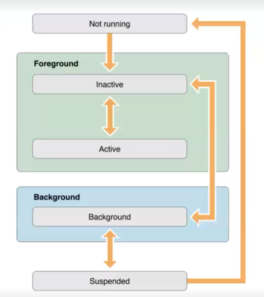
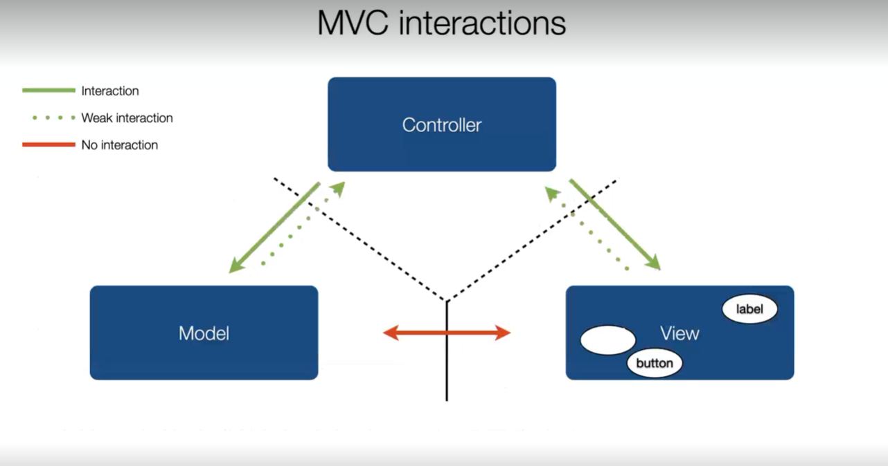

### Alcune Keyword dell'OBjective-C
- `id` = Puntatore ad un oggetto di qualsiasi tipo (simile a void* in C)
- `nil` = puntatore che punta a niente (NULL in C)
- `BOOL` = tipo definito (tramite typdef in objc.h) per boolean values
  - `YES == 1` (true)
  - `NO == 0` (false)
- `self` = puntatore all'oggetto corrente (uguale a 'this' in java)

### Memory management
- in objective-C tutti gli oggetti sono allocati dinamicamente sull'heap (motivo per cui si usano SEMPRE i pointer per utilizzare oggetti)
- Ci sono 2 aree in cui la memoria è controllata: stack and heap
- Nello stack:
  - lo stack è un area di memoria con politica FIFO
  - Local (function) variables storage
  - Invocation record: tiene informazioni su tutte le variabili
- Nell'heap:
  - ritorno di una zona di memoria casuale nell'heap della size specificata
  - Esempio:
  ```c
  char* cstr = malloc(sizeof(char)*6);
  for (int i = 0; i < 5; i++)
  	cstr[i] = ('a' + i);
  cstr[5] = '\0';
  printf("%s", cstr);
  //Chiamata di restituzione di memoria
  free(cstr);
  ```
  - java usa un garbage collector per automatizzare la restituzione della memoria
  - In objective-c si usa una tecnica chiamata: **reference counting**
    1. si mantiene un conto di nel numero di volte che si punta ad un oggetto
	2. quando si ha bisogno di una reference ad un oggetto si incrementa il count
	3. quando si ha finito di lavorare con l'oggetto si diminuisce il count
	4. quando il contatore arriva a 0 la memoria è liberata (<ins>accedere all'oggetto freeato -> crash dell'app</ins>) il metodo `dealloc` di NSObject è chiamato automaticamente (va implementato nel caso di oggetti che devono essere liberati)
- Per restituire memoria allocata dinamicamente in C e C++ si usa `free()` e `delete`


#### Manual Reference Counting
- un oggetto ritornato da **alloc/init** ha un reference count di 1
- NSObject definisce 2 metodi per incrementare e decrementare il reference count:
  - **retain**: increase by 1
  - **release**: decrease by 1
- Metodo `retainCount` ritorna il reference count per l'oggetto su cui è effettuata la chiamata
- modello: **Object ownership**
  - Ogni oggetto rimane in vita finché c'è almeno un proprietario
  - Per diventare un proprietario di un oggetto o lo si alloca oppure si chiama retain
  - release per fare in modo di non essere più proprietario -> 0 proprietari -> deallocazione
- **Temporary object ownership**
  - Ci sono volte in cui mandare un release potrebbe creare una deallocazione prematura
  - Molte classi danno sia l'opzione di creare oggetti da gestire manualmente, ma anche oggetti autorilascianti

#### Automatic Reference Counting
- Da iOS 4 c'è l'ARC, il compilatore analizza il codice e aggiunge automaticamente l'increment e il decrement o l'autorelease as needed
- l'ARC NON è un Garbage Collector -> non c'è un processo in esecuzione in memoria
- Meno codice -> meno rischio
- in Progetti che usano ARC l'uso dei metodi di Manual Reference Counting è proibito
- Non c'è nemmeno da implementare dealloc (lo fa automaticamente l'ARC)
- Introduzione del concetto delle **Weak e Strong references**
  - strong -> Diventiamo proprietari dell'oggetto a cui ci riferiamo 
    - una property strong è equivalente a retain ma strong ha accezione ARC, mentre retain ha accezione MRC
  - weak -> Non diventiamo proprietari dell'oggetto a cui ci riferiamo (e.g. l'oggetto potrebbe essere rilasciato senza che noi lo sappiamo)
    - una property weak per l'ARC il puntatore diventa nil se l'oggetto di cui non sono proprietario viene freeato, mentre nel caso dell'assign per l'MRC non viene cambiato il valore del puntatore.


### Protocols
- Contenitori di liste di metodi (akin alle interfacce in java)
- Definisce un modo per accedere ad un oggetto in base a quello che sa fare
- _Protocols define messaging contracts_: un oggetto sa rispondere a certi messaggi
- è diverso dall'ereditarietà in quanto si possono vedere oggetti come tipi di oggetti che fanno certe azioni più che facenti parte di una certa gerarchia di classi
- Una classe che si può definire conforme ad un protocollo se definisce tutti i metodi @required e eventualmente i metodi @optional

### Categories
- Aumentare le funzionalità della classe utili in certe situazioni particolari
- Estendere una classe è un approccio molto complesso oppure non fattibile.
- le Categories aggiungono metodi a classi esistenti senza creare sottoclassi

### Method Invocation
- La Method invocation è basata su message passing agli oggetti
- Il message passing è diverso dai metodi classici di invocazione perché il metodo eseguito non è legato ad una specifica sezione di codice: Il target è risolto dinamicamente a runtime
- Se il ricevitore di un messaggio non risponde -> un eccezione è lanciata
  - Motivo per cui bisogna essere sicuri che l'oggetto risponda utilizzando introspection (ispezionare oggetto prima di chiamare il metodo guardando se lo sa gestire) § Metodi di introspezione:
    - isKindOfClass: can be used to check if the object's type matches a class o una dei suoi subclasses
    - isMemberOfClass: usato per controllare se il tipo di oggetto 	matcha una cerca classe strettamente
    - respondsToSelector: utilizzato per controllare se un oggetto può rispondere ad un certo messaggio e casting pointers per forzare la chiamata di un certo metodo
- è possibile mandare un messaggio a nil: 0 è ritornato

### Object creation:
1. Allocazione di Memoria
2. Istanziazione e inizializzazione dell'oggetto
- L'allocazione è fatta usando il metodo `alloc` di `NSObject`
  - chiede all'OS di allocare una quantità di memoria sufficiente per l'oggetto
  - Ereditato da `NSObject`
  - Fa in modo di impostare tutti campi dell'oggetto a `nil`
- L'inizializzazione avviene attraverso un metodo che inizia con `init` (prefisso)
- Esempio Creazione di un Oggetto
```mm
MDPoi* poi = [[MDPoi alloc] initWithName:@"MyPoi" latitude:45.2 longitude: 10.12];
```


Tutte le variabili d'istanza sono settate propriamente tramite un **initializer** method
- Il nome dell'initializer inizia con `init`
- Ogni classe ha il suo inizializzatore progettato
- ogni inizializzatore deve prima invocare l'inizializzatore della superclasse e controllare che non abbia ritornato un oggetto `nil`
- Si possono avere più di un initializer ma ognuno deve chiamare quello designated

# iOS

### Multi-threading
- Dalla versione 4 iOS permette ad applicazioni di essere eseguite in background
  - Esecuzione di codice limitata
  - Alcune app vengono  sospese dal sistema per mantenere la vita della batteria
  - il sistema operativo è sempre autorizzato a killare l'app in background

### App Sandbox
- ambiente chiuso in cui l'app ha tutte le risorse di cui può aver bisogno
  - Nessun'altra app può accedere alla sandbox di un altra
  - si può pensare come se ogni app fosse un utente UNIX che non può accedere a documenti di altri utenti
- Componenti
  1. App bundle directory (read-execute) (signed): icone, suoni, asset
    - Il bundle è firmato (viene utilizzata una coppia di chiavi di crittografia)
	- Garantisce che il bundle non sia stato manomesso, e che quindi sia sempre integro
  2. Documents folder (read-write)
    - Cartella in cui l'app può leggere e scrivere file
  3. User-specific files 
    - Simile alla documents folder, ma viene anche sincronizzato con il cloud tramite backup e quindi persiste attraverso installazioni
  4. Temporary Files Folder (read-write): contenuti cancellati quando l'app esce
Nota: _per accedere alla sandbox di altre applicazioni ci vuole il permesso esplicito dell'utente (e.g. app contatti o foto)_

### Ciclo di Vita di un App

- Quando l'app è lanciata viene spostata nello stato active o background
- iOS crea un processo e un main thread per l'app dove viene chiamata la funzione main (main event loop)
- il main event loop riceve eventi dall'OS e l'app li gestisce
- Stato di background (l'app esiste ma non è più in foreground), mentre è in questo stato l'OS può decidere di mandarla ins tato suspended
- root view controller è la radice delle interfacce grafiche

```
App Launched -> App initialized -> Load root view controller -> wait for event -> handle event -> App Terminates
```

**UIApplication e UIApplicationDelegate**
- Un applicazione è un istanza di una classe chiamata UIApplication
- Non è mai toccata direttamente
- Ogni applicazione ha un delegate object che riceve i messaggi quando l'app cambia stato
- Metodi del protocollo delegate
  - `application:willFinishLaunchingWithOptions:` Questo metodo è la prima possibilità che ha un app per eseguire del codice al lancio
  - `application:didFinishLaunchingWithOptions` Questo metodo permette di fare qualsiasi inizializzazione prima che l'app sia mostrata all'utente
  - `applicationDidBecomeActive:` permette alla tua app di sapere che sta per andare in foreground; last minute preparation
  - `applicationWillResignActive:` permette alla tua app di sapere che sta transizionando via dal foreground state; da utilizzare per mettere l'app in uno stato dormiente
  - `applicationDidEnterBackground:` permette alla tua app di sapere che ora sta runnando nel background e potrebbe essere sospesa in qualsiasi momento
  - `applicationWillEnterForeground:` permette alla tua app di sapere che si sta muovendo fuori dalla zona di background e di nuovo nel foreground (ma non ancora attiva)
  - `applicationWillTerminate:` permette di sapere che l'app sta venendo terminata; questo metodo non è chiamato se l'app è sospesa.

### iOS Layers
- l'architettura di iOS è a layer
- Le app comunicano con l'hardware tramite un set di interfacce di sistema specifiche
- le Tecnologie sono impacchettate in framework come: Foundation o UIKit
- I livelli più bassi contengono servizi fondamentali
- Quando si lavora a livello alto (tutto OOP e Objective-C) quando si comincia a fare roba vicino all'hardware ci possono essere anche dei pezzi di C secco
- I Layer
  1. Core OS
	a. **Accelerate** Framework: vector and matrix math, digital signal processing, large number handling, image processing...
	b. **Core Bluetooth Framework**
	c. **Security Framework**: Symmetric Encryption
	d. **System**: kernel environment, drivers, low-level UNIX interfaces of the OS: concurrency, networking, file-system, standard IO, DNS Services, Locale Information, Memory Allocation, Math Computations
  2. Core Services: Servizi fondamentali
    a. **CF Network Framework**: BSD Sockets, TLS/SSL connections, DNS Resolution, HTTP/HTTPS connections
	b. **Core Data Framework**: Gestire un piccolo DB all'interno delle app
	c. **Core Foundation Framework**: (C Library) collections, strings, date and time, threads (molto semplice passare da rappresentazioni Obj-C a C)
	d. **Core Location Framework**: location and heading information for apps
	e. **Foundation Framework**: wraps Core Foundation in Objective-C Types
	f. **System Configuration** Framework: connectivity reachability
  3. Media: Graphics, audio, e tecnologie affini
    a. **AV  Foundation Framework**: playing, recording e gestione di contenuto audio-video
	b. **Media Player Framework**: high-level support per riprodurre audio e video
	c. **Core Audio Frameworks**: native (low-level) support for handling audio
	d. **Core Graphics Framework**: supporto per path-based drawing, antialiased rendering, gradient, images, colors
	e. **OpenGL ES Framework**: tools per disegnare 2D e 3D Content
  4. Cocoa Touch: Framework per la costruzione di app, multitasking, touch based input, notifications
    a. **UIKit Framework**: costruzione e gestione della UI di un app iOS
	  - Offre classi per costruire e gestire la UI
	  - Application object, event handling, drawing model, windows, views, e cotrolli
	b. **Map Kit Framework**: mappa scrollabile da essere incorporata nelle applicazioni
	c. **Game Kit Framework**: supporto per Game Center
	d. **Address Book Framework**: standard system interfaces per gestire contatti, 
	e. **MessageUI Framework**: interfacce per comporre emailo SMS
	f. **Event Kit Framework**: interfacce di sistema standard per gestire eventi del calendario

### iOS SDK 
- Il Software Development Kit contiene tools e interfacce che servono per sviluppare installare e testare app antive
- Tool: XCode
  - Interface Builder [disegnare le interfacce facilmente]
  - Debugger [Breakpoint per capire lo stato dell'applicazione e seguire passo passo l'esecuzione del codice]
  - Instruments [profiling dell'applicazione (utilizzo delle risorse)]
  - iOS Simulator [Permette di Testare le applicazioni su un emulatore]
- Language: Objective-C (+ un po' di C/C++)
- Libraries: iOS frameworks
- Documentation: iOS developer Library

## Model-View-Controller
- Pattern Architetturale per il software
- Organizza le parti di codice in campi puliti e separati, in accordo alle responsabilità e le feature di ciascuno
- Questa organizzazione è estremamente importante perché permette di creare applicazioni che sono semplici da: scrivere, mantenere e debuggare
- 3 Tipi di classi
  1. Classi di Modello: La rappresentazione dei dati usata nell'applicazione (il modello è <u>indipendente</u> dalla view), non sa come i dati verranno mostrati
  2. Classi di Vista:  è la UI che mostrerà i contenuti dell'applicazione, la view è <u>indipendente</u> dal modello siccome contiene gli elementi grafici che possono essere usati in ogni applicazione (normalmente non vengono nemmeno toccate ma usate quelle di default)
  3. Classi di Controllo: il cervello dell'applicazione, controlla come i dati nel modello devono essere mostrati nella view; è <u>molto dipendente</u> dal modello e dalla view siccome ha bisogno di sapere quali dati controllerà e quali sono gli elementi grafici con cui dovrà interagire (continene la logica applicativa)
    - Il controller mantiene reference agli elementi UI che utilizzerà, chiamati **outlet (IBOutlet)** (-namespace Interface Builder)
- Capire e applicare MVC è il 90% del lavoro quando si sviluppa per iOS

Interazioni: 


### View-to-Controller interactions
- La view non ha interazioni diretta con il controller
- Tuttavia la view deve informare il controller che alcuni event sono accaduti
1. Primo modo
  - l'interaction avviene in un maniera cieca tramite **actions (IBAction)**
  - Il controller può registrarsi ad una view in modo da essere il target; quando un azione è performata la view lo manderà al target (il controller)
2. Delegation
  - Quando alcuni eventi accadono la view deve informareil controller in modo che possa fare certe operazioni
  - il controller è il delegato, che significa che la view passa la responsibilità al controller per fare certe task (conforme al protocollo di delegato che fa certe cose)
3. Data Source
  - il controller è una **data source** per la view
  - Questo è fatto tramite protocolli
  - deve dare informazioni sul modello alle view

### Model-to-Controller interaction
<br>Notifications o KVO (key-value observing)
  - Quando i dati cambiano il modello deve informare il controller
  - Il modello manda il segnale di evento
  - Se il controller è interessato viene notificato

Nota: Applicazioni complesse hanno bisogno di più modelli MVC

User Interface: Screen, Window and View
- UIScreen identifica uno schermo fisico connesso al device
- UIWindow offre supporto per drawing 
- UIView objects fanno il drawing, questi oggetti sono attaccati alla window e disegnano il loro content quando gli viene chiesto dalla window
  - Organizzate in una gerarchia ad albero (se si elimina il padre tutti i child vengono rimossi)


### Views
- Porzione di interfaccia grafica
- Le viste possono integrare al loro interno altre viste
- comunicano tramite: target/action, delegation e data source
- Le view che rispondono a user interaction si chiamano controlli (**UIControl**): e.g. *UIButtons* e *UISliders* [possono generare eventi]

### View Controller 
- View Controller subclassano UIViewController
- Deve caricare risorse in modo da ottimizzarne l'utilizzo
- Un view controller deve solo caricare una view quando ce n'è bisogno, e può anche rilasciare la view in certe condizioni
- Il controller è specifico per l'app che si sta costruendo -> non riutilizzabile in progetti diversi (Si possono riutilizzare invece view e model)
- Ogni vista è controllata da un solo view controller
  - un controller owna la view
  - Le sottoviste possono essere controllati da diversi view controller: più view controller possono essere involved nel gestire le porzioni di una view complicata
  - Ogni view controller si interfaccia con un subset dei dati delle app
- le sottoclassi possono sovrascrivere metodi della classe UIViewController
- View controllers:
  - Storyboard: canvas to create controllers
  - programmatically

#### viewDidLoad
- After the view controller has been created and the outlets set, this method is invoked
- dove avviene la maggior parte dell'inizializzazione del view controller (dopo che gli outlet sono stati settati)
- Esempio di override
```objective-c
- (void) viewDidLoad {
	[super viewDidLoad];
	//Any additional setup after loading the view
}
```

#### viewWillAppear
- Invocato appena prima che il componente compaia sullo schermo
- L'argomento dice se la view sta apparendo con un animazione o istantaneamente
- *Potrebbe essere invocato più volte, nel caso una view appaia e poi scompaia e così*
- Utilizzato per:
  - operazioni che sono relative al cambiamento di essere e non essere mostrato su schermo
  - operazioni che non sono necessarie se la view non è mostrata su shcermo
- esempio di override
```objective-c
- (void) viewWillAppear:(BOOL)animated {
	[super viewWillAppear:animated];
	//...
}
```

#### viewWillDisappear
- potrebbe essere invocato più volte -> quando le viste vengono nascoste

#### viewDidAppear and ViewDidDisappear
- possono essere chiamati più volte -> Vengono chiamati appena dopo gli eventi a cui si riferiscono

#### viewWillLayoutSubviews and viewDidLayoutSubviews
- Questi metodi sono invocati quando le sottoview delle view stanno per essere posizionate
- Geometry related and layout code
- tra le esecuzioni di questi 2 metodi "autolayout" è performato

#### Autorotation
- Controlla se l'applicazione può essere ruotata in landscape mode e in portrait (default in `Info.plist` simile all'AndroidManifest)
- Se il view controller deve supportare l'autorotate deve essere sovrascritto questo metodo:
```objective-c
- (BOOL) shouldAutorotate {
	return YES;
}
```
- Se l'autorotation è attiva si può implementare il metodo che dice quali orientations sono supportate
```objective-c
- (NSUInteger) supportedInterfaceOrientations {
	//Costanti numeriche
	return UIInterfaceOrientationMaskPortrait;
}
```
ci sono anche metodi che notificano il controller di rotation events: 
- `willRotateToInterfaceOrientation:duration:`
- `willAnimateRotationToInterfaceOrientation:duration:`
- `didRotateToInterfaceOrientation:duration:`

#### didReceiveMemoryWarning
- Quando la memoria è poca, il view controller è notificato con questo metodo
- Se questo succede, tutte le risorse grosse non necessarie nell'heap devono essere rilasciate; per fare ciò i strong pointer devono essere settati a nil
- Buon codice dovrebbe evitare di arrivare a questo punto

### awakeFromNib and initialization of controllers
- init non è invocato su oggetti istanziati dallo storyboard
- `awakeFromNib` costruttore di un controller a partire da un storyboard
  - deve avere codice di inizializzazione che non viene usato da nessun'altra parte

### Struttura MVC tra più controller diversi
- Interazione corretta con utente tramite sequenza di schermate di diversi ViewController
- Good OOP Design: View controllers sono highly specialized (Ogni view controller controlla una view di specific content)
- Esempi di Apple: Contacts App, Calendar App, Music App

**Controllers of view controllers**
- `UINavigationController`
  - Perfetta per la navigazione di contenuto gerarchico
  - Utilizzo tipico per arrivaer a detailed content (e.g. categorie di settings, visualizzazioni del calendario sempre più specifiche)
  - Back button automatico per tornare indietro nella gerarchia
  - Organizza i controller in una struttura dati di tipo stack
  - metodi per modificare lo stack a runtime:
  ```objective-c
  -(void)pushViewController:(UIViewController*)viewController animated:(BOOL)animated //usato per pushare una view sulla cima dello stack
  -(UIViewController*)popViewControllerAnimated:(BOOL)animated //usato per poppare un view controller via dalla cima dello stack
  -(NSArray*)popToViewController:(UIViewController*)viewController animated:(BOOL)animated //usato per poppare tutti i controller dello stack finché uno specifico view controller non è sulla cima dello stack
  -(NSArray*)popToRootControllerAnimated:(BOOL)animated //usato per poppare tutti i view controller sullo stack tranne il root view controller
  ```
  - _Bisogna stare attenti ai memory leak dovuti ai cicli di aggiungimento dei controller senza rimuoverli dallo stack_
  - Da anche un'intelaiatura che permette all'utente di capire com'è strutturata l'app
    - Navigation Bar: 
	  - `title`: property della stringa che viene mostrata al centro della barra
	  - un back button che mostra il `title` dell'UIViewController precedente
	  - un array di `UIBarButtonItem` accessibile tramite la proprietà: `navigationItem.rightBarButtonItems`
    - optional Toolbar: Per gestire la toolbar c'è un NSArray toolbarItems
	- Segue: Transizione da un view controller al prossimo: identificate da: controller precedente, controller successivo, nome della transizione.
	  - Sono responsabili di performare la transizione visuale tra 2 view controller
	  - Può essere triggerata da: un outlet nello storyboard, programmaticamente
	  - Diverse tipologie di Segue: push, modal, custom
- `UITabBarController`
Non intercambiabili: 2 modi diversi di organizzare la navigazione

### Transition between MVC: Segues
- Transitions among MVCs sono chiamate segue
- Possonoe essere triggerati dai controlli della view o da eventi che avvengono nell'app

**Aggiungere un view controller in step:**
1. drag UIViewController dalla palette allo storyboard
2. creare una sottoclasse di UIViewController 
3. nell'inspector dell'identità si setta la classe del view controller alla classe appena creata

