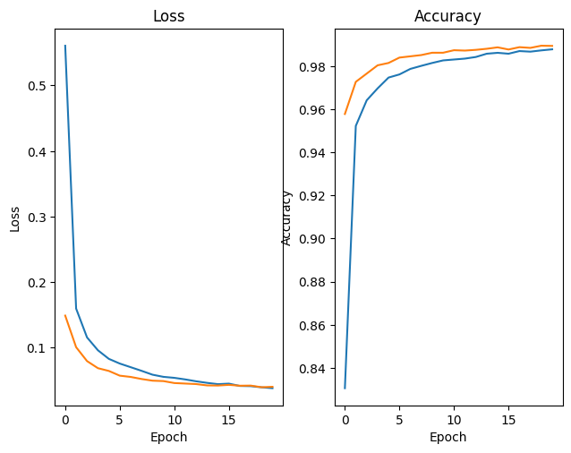

# Modello
Il modello contiene solo 2 layer convoluzionali perché il dataset su cui si sta lavorando è molto semplice e le feature da estrarre dall'immagine non sono complesse.

Per il primo layer si è deciso di utilizzare 10 filtri mentre 20 filtri per il secondo layer, (euristica: utilizzo di meno filtri per individuare edge semplici all'interno dell'immagine mentre più filtri per la composizione di questi edge in feature più complesse come cerchi e linee); tuttavia, per un dataset così semplice il cambiamento del numero di kernel non influenza significativamente l'accuratezza.

Da notare che il numero di filtri dell'ultimo layer convoluzionale influenzano molto di più il numero totale di parametri rispetto al primo siccome l'output di quel layer verrà appiattito e collegato al layer FC; si è deciso comunque di mantenere il numero di filtri più alto nel layer più vicino all'ouptut seguendo l'euristica relativa alla complessità delle feature estratte.

Il dropout inserito serve per evitare di andare in overfitting, è stato scelto 0.2 come parametro in modo da non rimuovere troppe connessioni e quindi evitare overfitting mantenendo un buona velocità di apprendimento prima del plateau.

Le modifiche al numero di filtri sono state effettuate principalmente per restare entro il numero di parametri necessari per la consegna, cercando di spingere il più possibile l'allenamento (epoche), evitando overfitting, per cercare di ottenere accuracy più alta possibile sul test set.

# Risultati

L'allenamento della rete riesce a svolgersi senza finire in overfitting ma arrivando ad un plateau in cui i miglioramenti con l'aumentare delle epoche diventano via via più piccoli.

Il modello offre prestazioni notevoli nonostante il basso numero di parametri: l'accuracy sul test set è di: 98.9%