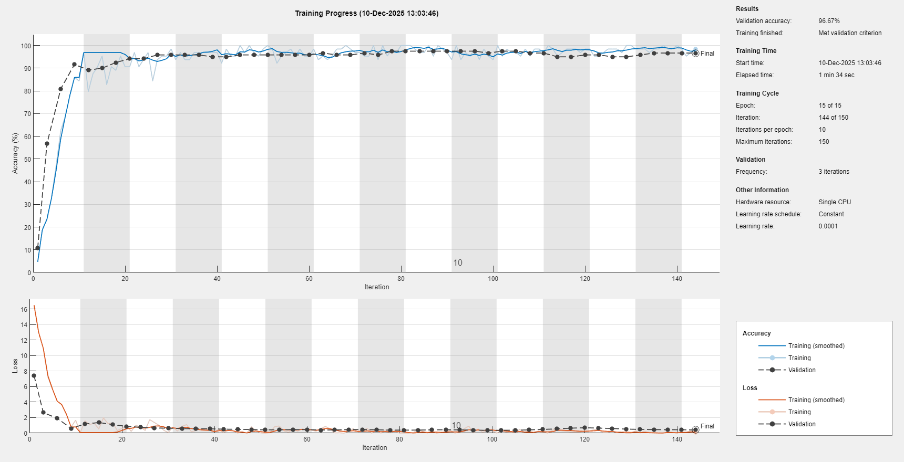

## Assignment 7 - CNN Finetuning
Per migliorare l'accuracy del modello sono state provate diverse tecniche.
Inizialmente per rendere il testing consistente tra le esecuzioni è stato fissato un seed per il generatore pseudorandomico. (`rng(42)`)
Poi è stato creato il validation set in aggiunta al test set dividendo il dataset originale in 3 partizioni:
- **`68%`**: Training Set
- **`20%`**: Test Set
- **`12%`**: Validation Set

### Modifiche alla struttura di rete
In seguito per migliorare la classificazione è stato scelto di estrarre meno layer congelati da alexnet (`end-6` <- `end-3`) per fare finetuning partendo da layer più _universali_ della rate originale.

Per migliorare la classificazione sul test set è stato anche aggiunto un **layer di dropout di magnitudine 0.4** prima del layer FC finale per la classificazione con softmax, questo ha migliorato considerevolmente l'accuratezza sul test set e l'overfitting durante l'allenamento.

### Data Augmentation
Per migliorare le prestazioni generalizzando sono state migliorate le tecniche di data augmentation applicate:
- **Reflection**: cambiata da asse *Y* a asse *X* (generalizzare sull'orientamento specchiato delle foto)
- **Translation**: Aumentata la magnitudine della traslazione `(-2,2) -> (-10, 10)` per permettere una migliore generalizzazione (risultati non troppo significativi, la traslazione non generalizza più di tanto)
- **Rotation**: Possibilità delle foto di essere leggermente fuori asse `(-5°, +5°)`
- **Scale**: Permettiamo che le immagini siano leggermente distorte (`(0.9, 1.1)` scala su entrambe le dimensioni)

### Opzioni di Training
Modificate le opzioni di training per migliorare l'accuracy il più possibile spingendo l'allenamento della rete
- **MiniBatchSize**: Aumentata da 15 a 32 e poi successivamente da 32 a 64, questo ha permesso di considerare molti più sample per ogni aggiornamento del training e conseguentemente ha ridutto overfitting e reso l'allenamento della rete più stabile
- **MaxEpochs**: Aumentato da 6 a 15 per permettere alla rete di raggiungere una buona convergenza prima di terminare l'allenamento
- **L2Regularization**: Aggiunto un parametro per inserire un parametro di penalizzazione basato sulla norma L2 per evitare overfitting 
- **EarlyStopping (ValidationPatience)**: Aggiunto per terminare l'allenamento presto se non vi sono miglioramenti dopo un certo numero di minibatch propagations
- ~~***OutputNetwork**: best-validation-loss*~~: Inizialmente è stato utilizzato questo parametro per ottenere il network che avesse i risultati migliori sul validation set, tuttavia per come MATLAB gestisce/crea i dataset durante lo split, una buona performance sul validation set non rispecchiava altrettanto buone prestazioni sul test set, perciò si è deciso di scartare questa opzione e utilizzare l'ultimo network restituito dall'allenamento con Early-Stopping

### Risultati
Il modello mostra una buona generalizzazione durante il training riuscendo a raggiungere risultati vicino al 100% come accuracy discostandosi di poco rispetto alla validation accuracy curve, il risultato finale per il validation set dopo la terminazione dell'alenamento è di 96.67%.

Non si tratta del risultato migliore all'interno del training rispetto al validation set, ma permette di generalizzare meglio per la valutazione sul test set che mostra una performance di: 97.50%